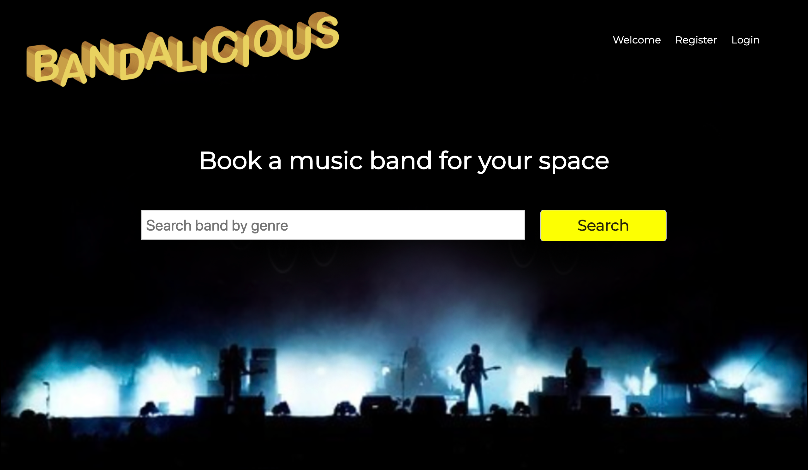
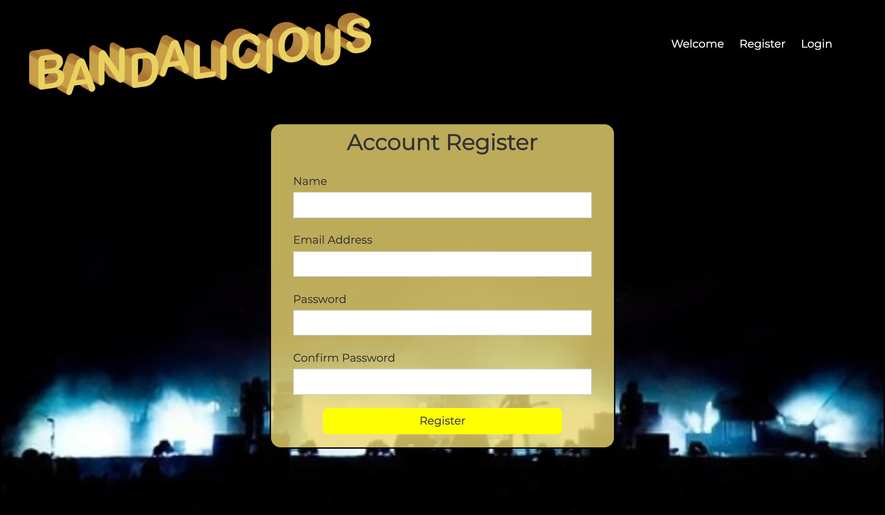
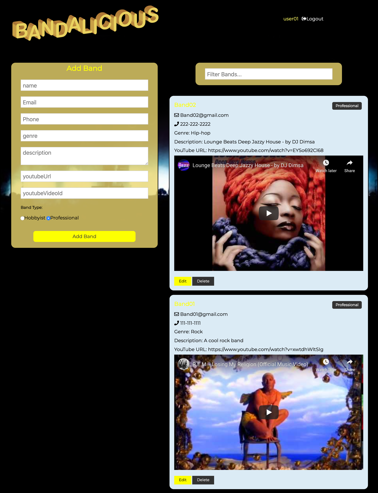
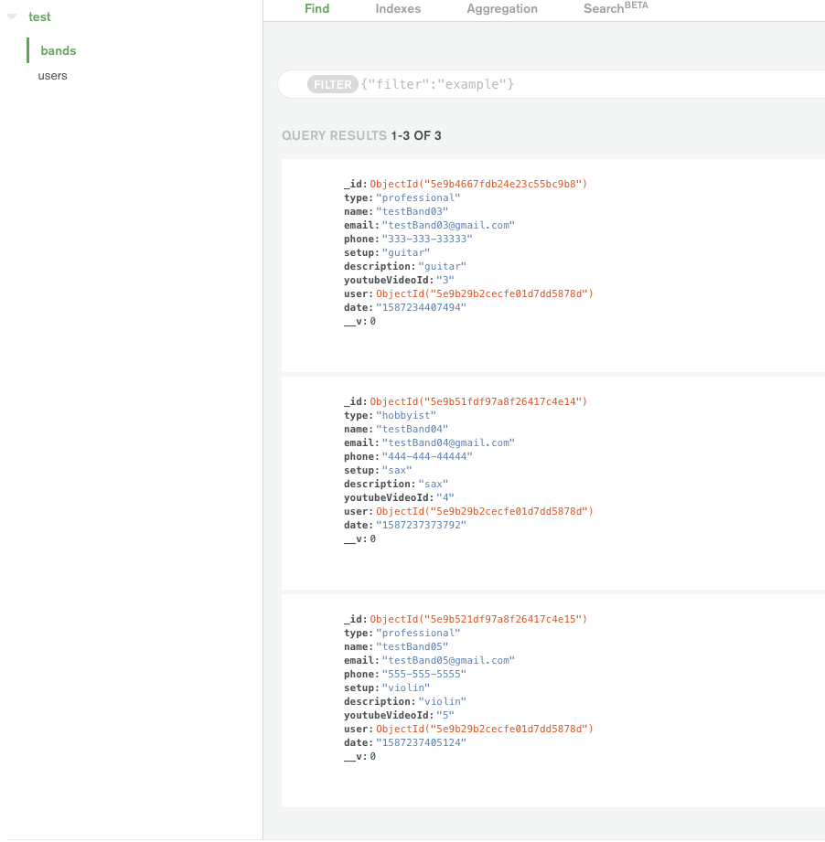

# bandaidReact

Bandaid is a global freelancing platform where music professionals and skilled hobbyists can present their music with a description, a video link and their hourly price to be noticed by clients in search of live musicians for hire.

Tools: MERN stack, MongoDB Atlas cluster, Express, React 16.8+ Hooks (useState, useEffect, useContext, useReducer, useRef), CSS and Bootstrap, JWT (JSON Web Token) for authentication, Node.

Registration and log in page:

Adding and updating bands:

Cluster on MongoDB.Atlas:

