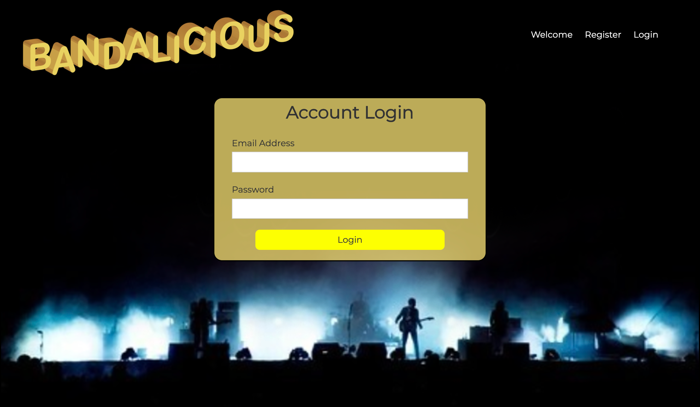

# bandaidReact

Tools: MERN stack
 MongoDB, Express, React 16.8+ Hooks (useState, useEffect, useContext, useReducer, useRef) + JWT (JSON Web Token) for authentication, Node

Registration and log in page:

Adding and updating bands:

Cluster on MongoDB.Atlas:

